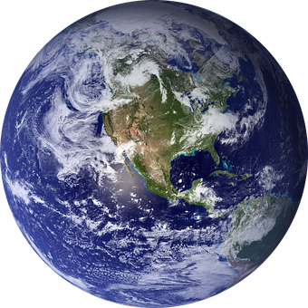

<h1> Nivel 1 </h1>
.........................

Enemigos totales: 15

.........................

Objetivos: Eliminar a los enemigos y salvar el planeta de los invasores 

.........................

Area: Planeta tierra

.........................

<link href="https://fonts.googleapis.com/css2?family=Orbitron:wght@400;700&display=swap" rel="stylesheet">
